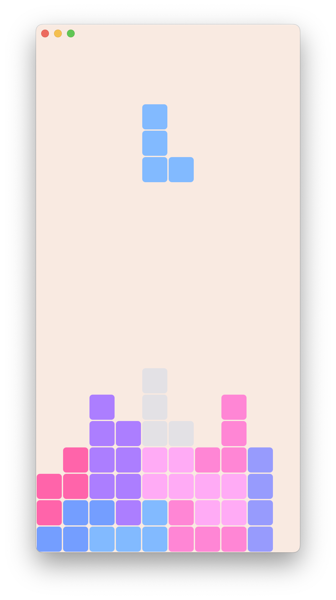
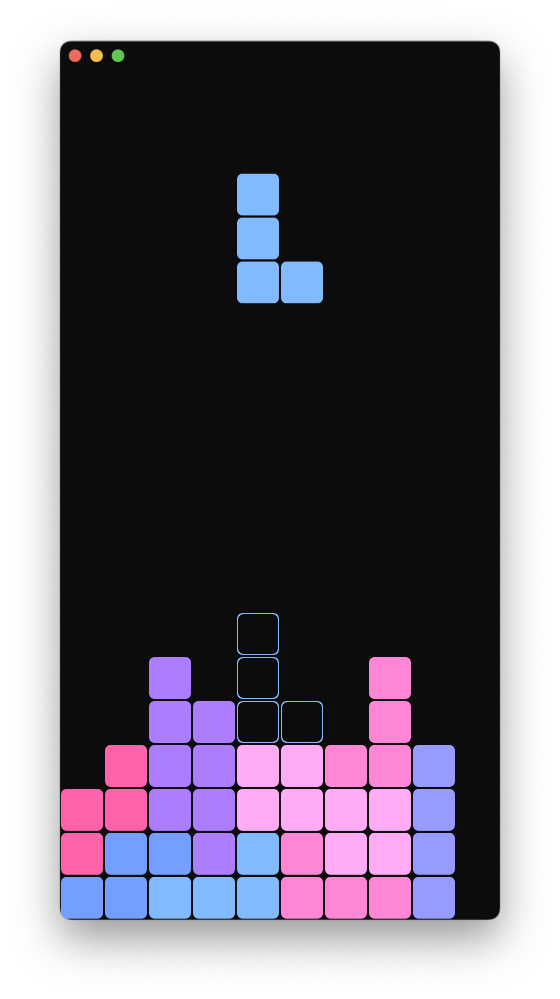
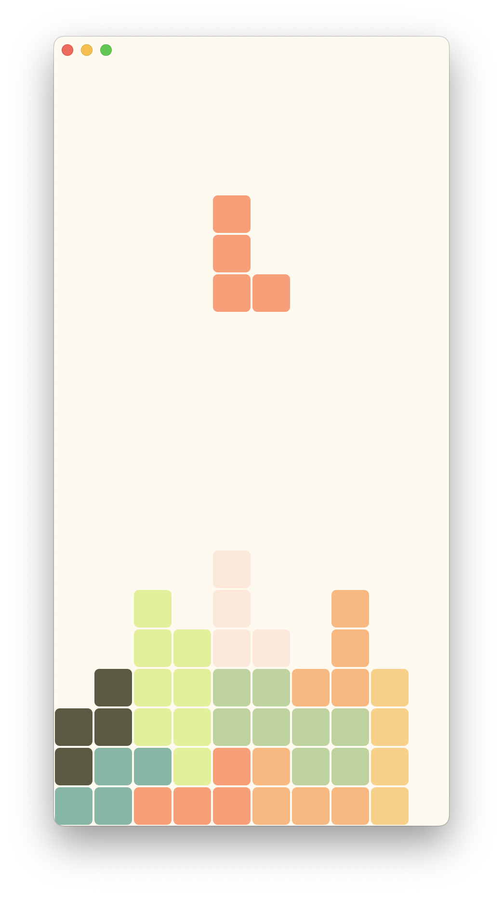
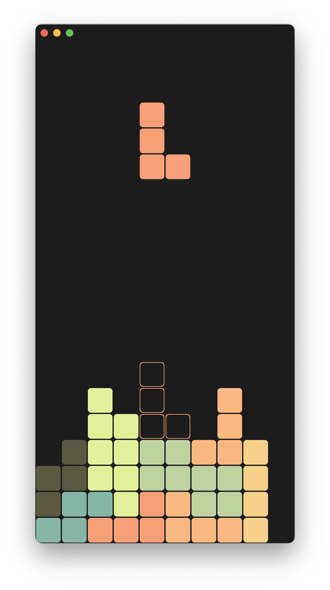

# minimal-tetris

🏆 One of the Top Projects for the McGill Projects showcase event 🎉

minimal-tetris is my minimal implementation of the classic NES game Tetris.

Has different themes and a hold piece. Uses 7-bag randomization.

It is written in Kotlin and uses [Swing](https://en.wikipedia.org/wiki/Swing_(Java)) for the UI with the plugin [FlatLaf](https://www.formdev.com/flatlaf/) for theming.

## How to play

The game is controlled with the arrow keys:

- **Left arrow**: move the current piece to the left
- **Right arrow**: move the current piece to the right
- **Up arrow**: rotate the current piece
- **Down arrow**: move the current piece down
- **Space**: drop the current piece
- **Escape**: pause the game
- **C**: hold the current piece

## Demo + Screenshots

https://user-images.githubusercontent.com/91647750/222933041-89697b8a-ab27-46ca-896d-ee80207d4d35.mp4

### Baby theme

#### Light

#### Dark

## Retro theme

#### Light

#### Dark

